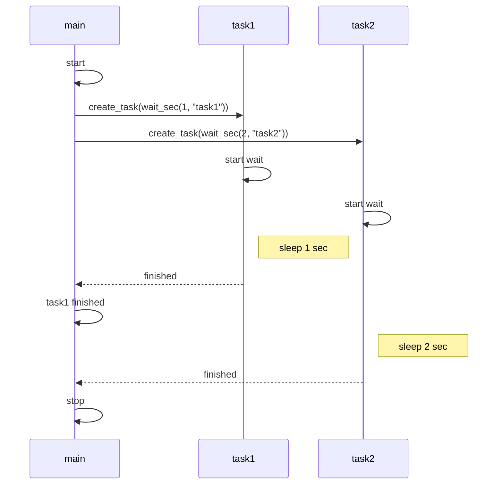

# asyncio

本质是, 利用单进程解决多个 task 的调度模型.

- 优点
  - 无 context 切换开销, 进程创建等开销. 因此, 利于大量小任务.
- 缺点
  - 单进程. 无多核资源利用.

## simple

The flow of simple:

key ideas:
- task 共享资源.
- 类似 CPU 分时调用. wait 时类似挂起.
- wait时, 所有 task 时间流逝一致, 都是真实世界时间. 类似闹钟.